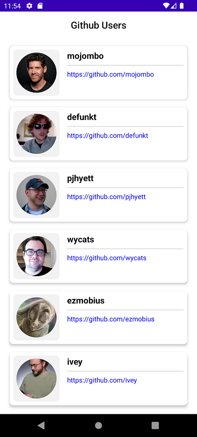
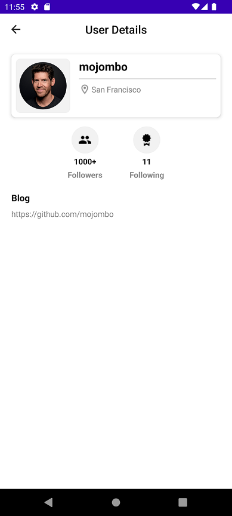

# KGithubManager

## Architecture
This project follow **CLean Architecture**.

The project contains 3 modules:

1. Domain

   - This module contains business logic models of the application
   - This module define the Repository interfaces, then the higher modules can implement these interfaces
   - It also define Use Cases that handle business logic of the application using Repository interfaces

2. Data

   - This module contains Repository implementations
   - This module contains Android components (such as Network, Data Soures..) that can be used in Repository implementation

3. Presentation

   - This module handles UI parts of the application
   - This module follows MVVM pattern

The project use **Hilt** for Dependency Injection

## Libraries used

The application uses following external libraries:

1. **Glide**: to load image to ImageView
2. **Retrofit**: to handle HTTP requests
4. **Room**: to handle CRUD actions

## Requirements

### UI

The application has 2 pages:

1. Main page

   - To display the list of user.
   - How to display data:

     Step 1: fetch data from local storage first. If the local storage has data, display data immediately

     Step 2: If there is no data, the application fetch data from API, save data into local storage and display data

   - The data is fetched page by page (using both local storage or API)
   - When users click on a user, the application navigates to Details page

2. Details page

   - To display the user details
   - The data is fetch from API

**Note**
```
To simulate the loading from Local storage and API, I added a delay for API calls
```

### Unit Test

The project includes Unit Test for module **Data** (locate at `data/src/test`)

The Unit Test is done with `JUnit`, `Mockito`, `Mockk`

1. `FetchUserApiTest`

   Test case 1: `execute_Response_Null()`

   Test case 2: `execute_Response_Success()`

2. `FetchUserDetailsApiTest`

   Test case 1: `execute_Response_Null()`

   Test case 2: `execute_Response_Success()`

3. `RoomUserStoreTest`

   Test case 1: `getUsers_Response_Empty()`

   Test case 2: `getUsers_Response_NotEmpty()`

   Test case 3: `saveUser`

4. `UserRepositoryImplTest`

   Test case 1: `fetchUserDetails_Response_Null()`

   Test case 2: `fetchUserDetails_Response_NotSuccess()`

   Test case 3: `fetchUserDetails_Response_Success`

   Test case 4: `fetchUsers_Database_Empty`

   Test case 5: `fetchUsers_Database_NotEmpty`

## Screen record





   